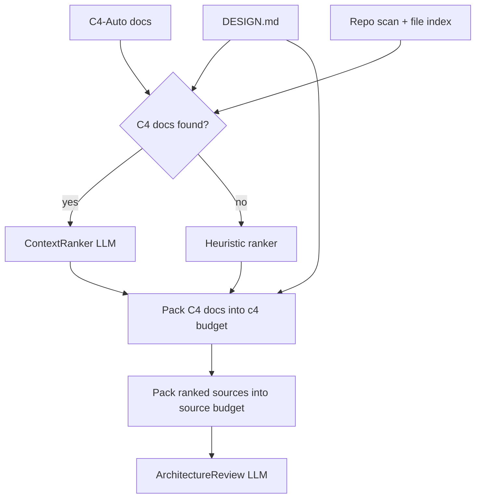

# GuardDog

**Architecture review CLI for evolutionary architecture risks.**

---

## Where this came from

During a client engagement I worked on systems that did not seem designed for change or co-existence. They had been shaped for **greenfield** delivery — clean starts, happy paths — rather than **brownfield** reality: incremental migration, overlapping versions, and systems that must evolve while still running.

A colleague recommended [*Building Evolutionary Architectures*](https://evolutionaryarchitecture.com/) by Neal Ford, Rebecca Parsons, and Patrick Kua. After reading it, I kept thinking about how to apply that thinking in a world where AI coding assistants are writing and refactoring code at scale. Manual architecture review does not scale; lint rules catch syntax, not intent; and without an explicit record of what the architecture *should* be, drift is invisible until it hurts.

That is how GuardDog came about.

GuardDog is not a style checker or a generic code-smell detector. It asks a different question: **can this codebase evolve safely over time?** It looks for coupling, boundary drift, high blast-radius change areas, weak encapsulation, missing fitness functions, and the other risks the book emphasises — with a bias toward incremental remediation, not rewrites.

### Maturity and expectations

GuardDog is **useful today**, but it is **not yet ready for fully autonomous “fix until green” loops**. Reviews are LLM-driven and exploratory: if you run the same repo multiple times, you may see **new high-severity items** even after fixing the last batch — not always because of regressions, but because the model surfaces the next layer of issues (and can occasionally misread redacted or partial context). Treating “zero highs” as a release gate without human triage can become an endless loop.

On a real **self-review of GuardDog** (same repo, same day), iterative fixes plus prompt calibration produced a clear shift from contract-breaking **highs** to governance **mediums**:

| Run | Overall risk | High | Critical | Top findings (synopsis) |
|-----|--------------|------|----------|-------------------------|
| **First self-review** | high | **3** | 0 | **GD-001** — `designFile` schema/type drift (LLM JSON vs `IReviewResult`). **GD-002** — `sampledReview` could be forced `true` by the LLM instead of pipeline-only. **GD-003** — empty LLM results not detected reliably (`isEmptyDefaultResult` too narrow). |
| **Latest self-review** (after fixes + severity rubric in prompt) | medium | **0** | 0 | **GD-001** — `--model` affects token encoding but not LLM driver selection. **GD-002** — `.gitignore` is approximate (no negation / full git semantics). **GD-003** — context summary counts mix rankable sources with design/C4 docs. |

The first three **highs were real, fixable contract bugs** (now covered by unit tests). The latest run has **no highs** — remaining items are incremental hardening, not broken core workflows. Use GuardDog as an **architecture radar**, not an unattended CI gate, until evals and deterministic fitness functions mature.

---

## How it works

GuardDog rests on four ideas:

### 1. Designers declare intent in `DESIGN.md`

System designers write a document — typically `DESIGN.md` — that explains how they want the system to be structured: layers, encapsulation, extension points, allowed dependencies, deployment boundaries, and so on. This is the **architectural contract**. GuardDog uses it to distinguish findings that drift from declared intent from general evolutionary-architecture observations.

### 2. C4-Auto docs guide what code to read

GuardDog does not send the whole repository to the LLM. Instead it uses a **two-stage context pipeline**:

1. **Rank** — decide which source files matter most for architecture review
2. **Pack** — read file contents into token budgets until full (counted with **tiktoken**)

When [C4-Auto](https://github.com/jonverrier/C4-Auto) has generated architecture docs (`README.StrongAI.Component.md`, `README.StrongAI.Context.md`, or custom basenames via `--component-file` / `--context-file`), GuardDog runs a **ContextRanker** LLM pass. The ranker reads your C4 diagrams, design intent, and a lightweight file index (path, extension, size — not full source), then returns an ordered list of the most architecturally important source files: boundary hotspots, entry points, persistence seams, and modules named in C4 diagrams.

If no C4 docs exist, GuardDog falls back to **heuristic ranking** (config, CI, package manifests, sampled source directories).

Recommended workflow:

```bash
# Step 1: generate C4 architecture docs (C4-Auto)
c4-auto --dir ./src --c4component --c4context --rollup

# Step 2: review with GuardDog
guarddog review . --design DESIGN.md --out review.md --json review.json
```

GuardDog consumes existing C4 files; it does not invoke C4-Auto itself.



**Layered token budgets** (defaults, overridable on the CLI):

| Layer | CLI flag | Default | Behaviour |
|-------|----------|---------|-----------|
| `DESIGN.md` | `--design-token-budget` | 4,000 | Packed first; shallow-path priority (single file) |
| C4 docs (review) | `--c4-token-budget` | 12,000 | Depth order (rollups first); greedy pack until budget full |
| C4 docs (ranker) | `--ranker-c4-token-budget` | 12,000 | Same depth order as review; caps ContextRanker input |
| Source files | `--context-token-budget` | 32,000 | Greedy pack by rank until budget full |
| Per-file cap | `--max-file-tokens` | 4,096 | Oversized files skipped with manifest reason |

Each layer records `tokensUsed` and `budgetUtilization` (`budget`, `used`, `fillRatio`) in `contextSelection`.

Files are tokenised lazily — GuardDog counts and packs one file at a time, stopping when the budget is full. It never tokenises the entire repo upfront.

The `{repoMap}` JSON sent to the reviewer includes a `contextSelection` object recording how context was chosen:

- `ranker`: `c4-llm` or `heuristic`
- `summary`: candidate counts (`totalCandidates`, `rankedByRanker`, `unrankedByRanker`) and packer skip totals
- `truncation`: `rankerCapped` (ranker focused on a subset) vs `budgetExhausted` (token limits skipped files)
- `manifest`: each packed path with rank, token count, included/skipped, and reason
- `tokensUsed`: per-layer consumption (`design`, `c4`, `source`)
- `budgetUtilization`: per-layer `budget`, `used`, and `fillRatio`

Review reports include a **Context coverage** section that states whether ranking was **C4-guided** or **heuristic**, how many C4 docs were included, and what was **discarded** per layer (design / C4 / source).

**`sampledReview`** is set only when **ranked source files** were skipped due to token budgets — C4 or design truncation alone does not mark a sampled review.

### 3. An LLM acts as architecture reviewer

After context is assembled, GuardDog prompts an LLM to review the codebase as an architect. The **ArchitectureReview** prompt is distilled from the key principles of *Building Evolutionary Architectures* (adaptability, coupling, optionality, fitness functions, operability, blast radius). It receives design intent, the enriched repo map (including the context manifest), and the selected file contents, then returns **structured findings** — severity, evidence, risk, blast radius, and incremental remediation suggestions.

Both review prompts live in `src/Prompts.json` and load via [PromptRepository](https://github.com/jonverrier/PromptRepository):

| Prompt | Purpose | Validated by |
|--------|---------|--------------|
| `ContextRanker` | Rank source files using C4 docs + file index | Evals (when added) |
| `ArchitectureReview` | Produce structured architecture findings | Evals (when added) |

Changing prompt wording is a **prompt change** — not a code change. Unit tests cover wiring (expansion, parsing, filtering, token packing); prompt quality is an eval concern.

The ArchitectureReview prompt is below (source of truth: `src/Prompts.json`, v1.1). At runtime, `{architectureIntent}`, `{repoMap}`, `{contextFilesSection}`, and `{sampledReviewNote}` are replaced with scanned repository content.

**System prompt (reviewer constitution):**

```text
You are an expert software architect reviewing systems for their ability to evolve safely over time.

Your philosophy is based on evolutionary architecture principles:

- maximise adaptability
- reduce coupling
- preserve optionality
- prefer incremental migration over rewrites
- encode architecture as executable fitness functions
- optimise for operability and observability
- minimise blast radius of change

You do not judge systems based on trend-following or stylistic purity.

You evaluate:

- modularity
- dependency structure
- deployability
- observability
- schema evolution safety
- API compatibility
- operational resilience
- testability
- architectural governance
- migration capability
- team autonomy implications

Always:

- ground findings in concrete evidence from the codebase
- distinguish fact from inference
- explain operational consequences
- estimate change risk and blast radius
- propose incremental remediation paths

Avoid recommending rewrites unless absolutely unavoidable.
```

**User prompt (architecture intent, repo map, context files, and review task):**

```text
## Architecture Intent

<architecture-intent>
{architectureIntent}
</architecture-intent>

## Repository Map

<repo-map>
{repoMap}
</repo-map>

## Selected Context Files

{sampledReviewNote}
{contextFilesSection}

## Review Task

Perform an evolutionary architecture review of the repository described above.

Distinguish between:
1. Findings that violate or drift from the declared architectural intent (when a design file is provided)
2. General evolutionary architecture findings (coupling, boundaries, deployability, observability, etc.)

Return JSON matching the required schema with tool set to "GuardDog".

Requirements:
- Assign each finding a unique id (e.g. GD-001, GD-002)
- Include concrete evidence with file or directory references where possible (use empty string for file or directory when not applicable — all three evidence fields are required in JSON)
- Separate facts (directly observed) from inferences (reasoned conclusions)
- Apply severity, impact, confidence, and blast radius using the rubrics below (do not inflate ratings)
- Propose incremental remediation — avoid rewrite recommendations unless unavoidable
- Suggest executable fitness functions (CI rules, contract tests, lint rules, metrics)
- Include suggestedLabels for GitHub issues (e.g. architecture, coupling, observability)

## Severity rubric (finding.severity)

Rate how bad the issue is **if the finding is true** on the default or documented primary workflow:

- **critical**: Core review/analysis fails, corrupts output, causes data loss, or exposes a security breach on the default path without an obvious safe workaround.
- **high**: Violates declared architectural intent (when a design file exists), breaks a primary workflow without a reasonable workaround, or causes deterministic contract violations (schema/parser drift) that undermine trust in outputs.
- **medium**: Real architectural drift, missing guardrails, or reliability gaps with a workaround; prompt/contract drift that degrades quality but does not crash; optional integration brittleness.
- **low**: Style, documentation, nice-to-have fitness functions, or speculative improvements.

Do **not** assign **high** or **critical** for recommendations such as "add more tests" or "centralize config" when current behaviour already matches intent — use **medium** or **low** unless absence already causes failure today.

## Impact rubric (finding.impact)

Rate **who is affected if the issue manifests** (not how alarming it sounds):

- **high**: Affects all users on default configuration or typical CI (`guarddog review` without optional flags).
- **medium**: Affects optional paths only (e.g. `--github-issue --confirm`), specific configurations, or a subset of repositories.
- **low**: Edge cases, future risk, or developer-experience friction without blocking core review output.

## Confidence and blast radius

- **confidence**: **high** only when supported by direct evidence in the supplied context; use **medium** or **low** when inferring from partial files or patterns.
- **blastRadius.rating**: Use the same scale as **impact**; reasoning should describe affected modules, workflows, or teams.

## summary.mainThemes and summary.overallRisk

In summary.mainThemes, list 3-5 cross-cutting themes.
In summary.overallRisk, set the highest **severity** among findings that represent real present risk (not wish-list improvements). Prefer **medium** when the strongest items are governance or test-gap recommendations only.

If architecture intent is absent, focus on general evolutionary architecture risks and note that findings are not measured against declared intent.
```

### 4. A CLI that fits any workflow

Everything is packaged as a command-line tool so it is easy to run locally, in CI, on a schedule, or from another agent. Output is Markdown and JSON; optionally GuardDog opens a GitHub issue (dry-run by default, create with `--confirm`).

```bash
guarddog review . --design DESIGN.md --out review.md --json review.json
```

---

## Install
**Prerequisites:** Node.js 20+, `OPENAI_API_KEY` for LLM reviews.

For GitHub Packages, configure `.npmrc`:

```ini
@jonverrier:registry=https://npm.pkg.github.com
//npm.pkg.github.com/:_authToken=${NODE_AUTH_TOKEN}
```

Global CLI:

```bash
npm install -g @jonverrier/guard-dog
```

Project devDependency (e.g. architecture review in CI or scripts):

```bash
npm install --save-dev @jonverrier/guard-dog
```

Then run via `npx guarddog` or the `guarddog` bin from `node_modules/.bin`.

---

## Quick start

Initialize configuration in a repository:

```bash
guarddog init
```

Run an architecture review (run [C4-Auto](https://github.com/jonverrier/C4-Auto) first for best results):

```bash
# Optional: generate C4 architecture docs first
c4-auto --dir ./src --c4component --c4context --rollup

guarddog review . \
  --design ./DESIGN.md \
  --out ./guarddog-review.md \
  --json ./guarddog-review.json
```

When C4 docs exist, GuardDog uses the **ContextRanker** to pick source files, then **tiktoken** to pack them into budgets. Without C4 docs, heuristic sampling is used instead. See [Context selection](#context-selection) for details.

---

## CLI

### Primary command

```bash
guarddog review <repoPath> \
  --design ./DESIGN.md \
  --out ./guarddog-review.md \
  --json ./guarddog-review.json
```

### Options

| Option | Description |
|--------|-------------|
| `--design <path>` | Architecture intent / design file |
| `--out <path>` | Markdown output path |
| `--json <path>` | JSON output path |
| `--min-severity <level>` | `low` \| `medium` \| `high` \| `critical` (default: `medium`) |
| `--min-impact <level>` | `low` \| `medium` \| `high` \| `critical` (default: `medium`) |
| `--max-findings <number>` | Limit number of findings (default: 20) |
| `--dry-run` | Do not write files or create issues |
| `--github-issue` | Enable GitHub issue creation |
| `--repo <owner/name>` | GitHub repo target |
| `--issue-mode single\|per-finding` | Issue creation mode (default: `single`) |
| `--model <model-name>` | LLM model name |
| `--context-token-budget <n>` | Source file token budget (default: `32000`) |
| `--c4-token-budget <n>` | C4 documentation token budget for review (default: `12000`) |
| `--design-token-budget <n>` | Design file token budget (default: `4000`) |
| `--ranker-c4-token-budget <n>` | C4 token budget for ContextRanker (default: same as `--c4-token-budget`) |
| `--max-file-tokens <n>` | Per-file token cap (default: `4096`) |
| `--component-file <name>` | C4 component doc basename (default: `README.StrongAI.Component.md`) |
| `--context-file <name>` | C4 context doc basename (default: `README.StrongAI.Context.md`) |
| `--no-github` | Disable GitHub integration |
| `--confirm` | Confirm GitHub issue creation (default is dry-run for GitHub) |

### Init command

```bash
guarddog init [repoPath]
```

Creates:

```text
.guarddog/
  guarddog.config.json
  reviewer.md
  finding.schema.json
```

---

## GitHub integration

```bash
guarddog review . \
  --design DESIGN.md \
  --github-issue \
  --repo jonverrier/my-repo \
  --confirm
```

Requires `GITHUB_TOKEN`. Without `--confirm`, issue title and body are printed only (dry-run).

---

## Context selection

GuardDog's context pipeline is the bridge between a large codebase and a bounded LLM prompt. It answers: *given what we know about this system's architecture, which files should the reviewer actually read?*

### Ranker modes

| Mode | When | How |
|------|------|-----|
| `c4-llm` | C4-Auto docs found in repo | ContextRanker prompt reads C4 docs + design + file index; returns ranked paths |
| `heuristic` | No C4 docs, or ranker fails | Config, CI, manifests, and sampled source/test files by directory |

### Token budgets

All budgets are counted with **tiktoken** (same encoding family as OpenAI models). Defaults suit most repos; large monorepos can raise `--context-token-budget` (e.g. `64000`).

```bash
guarddog review . \
  --design DESIGN.md \
  --context-token-budget 32000 \
  --c4-token-budget 12000 \
  --max-file-tokens 4096 \
  --component-file README.StrongAI.Component.md \
  --context-file README.StrongAI.Context.md
```

Budgets can also be set in `.guarddog/guarddog.config.json`.

### Context manifest

The review prompt's `{repoMap}` JSON includes `contextSelection`:

```json
{
  "contextSelection": {
    "ranker": "c4-llm",
    "contextTokenBudget": 32000,
    "c4TokenBudget": 12000,
    "designTokenBudget": 4000,
    "rankerC4TokenBudget": 12000,
    "tokensUsed": { "design": 1200, "c4": 8420, "source": 12400 },
    "budgetUtilization": {
      "design": { "budget": 4000, "used": 1200, "fillRatio": 0.3 },
      "c4": { "budget": 12000, "used": 8420, "fillRatio": 0.702 },
      "source": { "budget": 32000, "used": 12400, "fillRatio": 0.388 }
    },
    "summary": {
      "totalCandidates": 240,
      "rankedByRanker": 80,
      "unrankedByRanker": 160,
      "packedIncluded": 42,
      "skippedBudget": 3,
      "skippedTooLarge": 1,
      "skippedUnreadable": 0
    },
    "truncation": { "rankerCapped": true, "budgetExhausted": true, "rankerC4Truncated": false },
    "manifest": [
      { "path": "src/api/users.ts", "rank": 5, "tokens": 120, "included": true },
      { "path": "src/utils/helpers.ts", "rank": 14, "tokens": 620, "included": false, "reason": "budget_exhausted" }
    ]
  }
}
```

This makes coverage explicit: the reviewer (and the human reading the output) can see how many candidates existed, how many the ranker considered, and which packed files were read vs skipped.

When `truncation.budgetExhausted` is true, the review output notes a **sampled review**. When only `truncation.rankerCapped` is true, the prompt notes ranker focus without marking a sampled review.

---

## Environment variables

| Variable | Purpose |
|----------|---------|
| `OPENAI_API_KEY` | Required for LLM review |
| `OPENAI_MODEL` | Optional model override |
| `GITHUB_TOKEN` | Required for confirmed GitHub issue creation |
| `GUARDDOG_DEBUG` | Set to `1` for debug logging |

---

## Development

```bash
npm install
npm run build
npm run test:ci
```

Run locally:

```bash
node dist/cli/index.js review . --design DESIGN.md --out review.md
```

---

## License

Copyright (c) 2025 Jon Verrier
