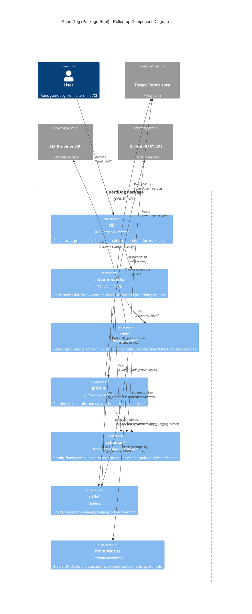

<!-- Generated by StrongAIAutoDoc 20260524 -->

GuardDog is a Node/TypeScript tool that performs automated architecture reviews on a target repository. Users invoke a CLI that dispatches to `init` (scaffolding a `.guarddog/` workspace) or `review` (running the end-to-end review workflow). The review pipeline scans and summarizes the repo, selects a bounded set of high-value context files within token budgets, builds prompt parameters, and calls an LLM through a small provider abstraction. The resulting structured findings are validated against shared schemas, filtered by configured thresholds, and rendered as a Markdown report (optionally with JSON/debug artifacts). Findings can also be published as GitHub issues.

Key components include the **CLI (`cli/`)**, which provides a stable user interface with consistent validation, error rendering, and explicit exit codes. **CLI Commands (`cli/commands/`)** implement `init` (scaffolding `.guarddog/` config, reviewer guidance, and schemas) and `review` (argument parsing, config loading, running the pipeline, summarizing results, and optionally publishing issues). The **Core pipeline (`core/`)** orchestrates repository scanning, C4-aware context ranking/selection with token budgeting, prompt construction, LLM invocation, strict parsing/validation of structured output, filtering by severity/impact thresholds, and Markdown report rendering. **Schemas (`schemas/`)** define the contracts that keep configuration, repo maps, context ranking, and findings interoperable across the CLI, core, and GitHub publishing. **GitHub (`github/`)** turns results into issue drafts and pushes them via the GitHub API. **Utilities (`utils/`)** supply shared errors, filesystem safety, logging, and token counting. **PromptIds.ts** centralizes prompt UUIDs used by the LLM calls.