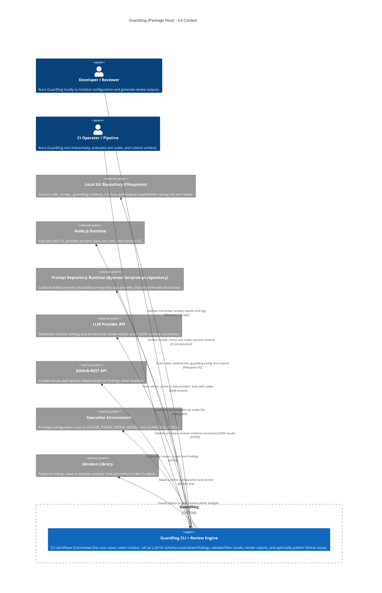

<!-- Generated by StrongAIAutoDoc 20260524 -->

GuardDog is a Node.js/TypeScript command-line toolchain used by developers and CI operators to run repository-focused architecture, security, and quality review workflows. It scans a local Git repository, selects representative context (including C4 documentation), and uses an external prompt runtime plus an LLM provider to generate schema-constrained, structured findings and a Markdown/JSON report. Results are validated, filtered by thresholds and token budgets, and emitted with deterministic exit codes for automation. When configured, GuardDog can publish findings as GitHub issues in a target repository. The package also includes utilities for repository scanning, safe context loading, and token estimation to support consistent, repeatable reviews.

GuardDog is invoked by a developer or CI pipeline via the CLI, which parses arguments, dispatches `init` and `review` workflows, and communicates outcomes through stdout/stderr plus explicit process exit codes for automation. It reads and writes to the local repository filesystem: `init` scaffolds `.guarddog/` configuration and guidance files, while `review` scans the repository (respecting ignore rules), selects and safely loads context, and produces Markdown/JSON outputs. For token budgeting, GuardDog uses the external tiktoken library and model selection from environment configuration (e.g., OPENAI_MODEL). Review execution depends on a prompt runtime (@jonverrier/prompt-repository) that loads prompt templates referenced by stable IDs (as centralized in PromptIds) and abstracts chat driver/model selection. GuardDog then calls an external LLM provider over HTTPS to obtain schema-constrained JSON findings, validates and filters them against thresholds, and optionally publishes results as GitHub issues using the GitHub REST API with credentials such as GITHUB_TOKEN from the execution environment.