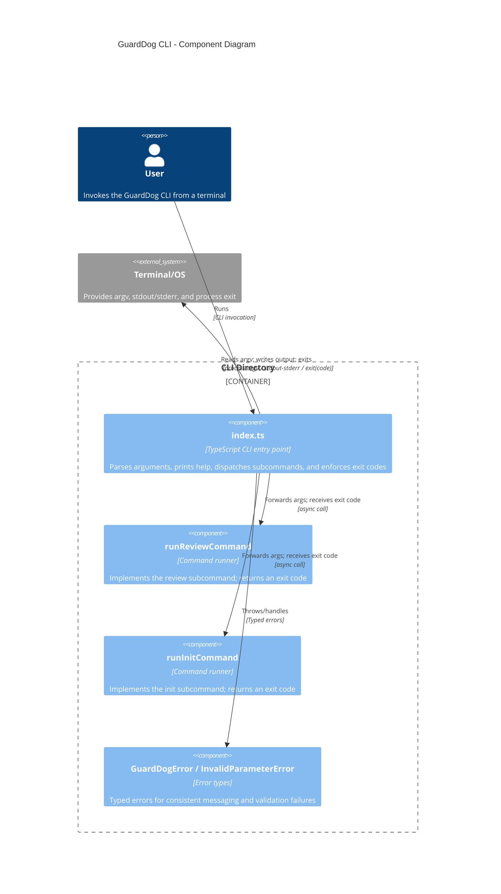

<!-- Generated by StrongAIAutoDoc 20260524 -->

This directory provides the GuardDog CLI entry point. It parses `process.argv`, prints help, selects a subcommand, and terminates with explicit exit codes. It dispatches to dedicated command runners for `review` and `init`, while enforcing consistent parameter validation. Errors are centralized: expected, typed GuardDog errors are rendered as friendly messages, and unexpected failures are treated as fatal.

**Key components**
- **index.ts** is the primary orchestration component: it parses CLI arguments, renders usage/help, selects the first argument as the command name, and forwards remaining parameters to the appropriate runner.  
- **runReviewCommand** and **runInitCommand** encapsulate subcommand behavior and return explicit exit codes that `index.ts` uses to terminate consistently.  
- **GuardDogError / InvalidParameterError** provide a typed error contract: known errors become user-friendly `Error:` messages with exit code 1, while unexpected exceptions bubble to a final fatal handler.