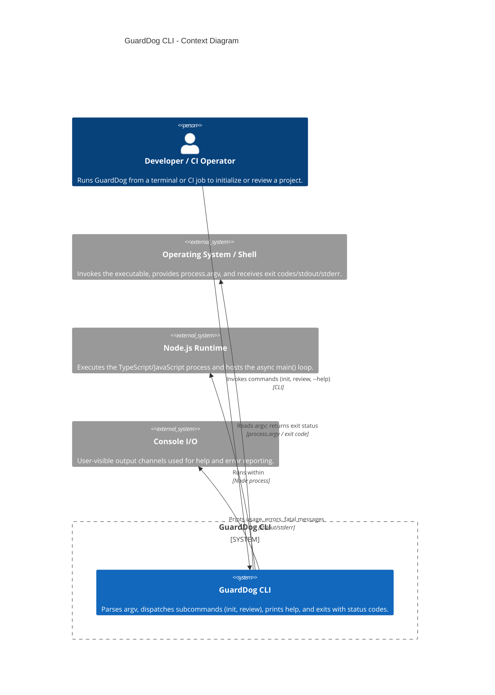

<!-- Generated by StrongAIAutoDoc 20260524 -->

GuardDog is a command-line tool that serves as the entry point for running security or quality workflows via subcommands. It interacts primarily with a developer or CI operator invoking it from a terminal, reading command-line arguments and returning explicit process exit codes. It delegates work to internal subcommand handlers for initialization and review operations, and it reports failures consistently through structured error types.

Key components and external interactions center on command invocation and error reporting. The CLI entry point reads arguments from the operating system shell via process.argv, selects a subcommand, and delegates execution to internal handlers for init and review. It communicates outcomes to calling scripts through explicit exit codes, enabling CI automation. User-facing feedback is written to console output, including usage help and friendly “Error:” messages for known GuardDogError failures. Unexpected exceptions are treated as fatal and reported distinctly before exiting with a nonzero status.