<!-- Generated by StrongAIAutoDoc 20260524 -->

These modules implement Guarddog CLI commands that operate on a target repository. `init.ts` scaffolds a standard `.guarddog/` directory and writes initial configuration, reviewer guidance, and a findings JSON schema to enable consistent reviews. `review.ts` parses and validates CLI arguments, resolves the repository location, runs the review workflow, applies configuration thresholds, logs progress, and optionally creates GitHub issues from findings using selectable issue modes and confirmation behavior.

```mermaid
C4Component
title Guarddog CLI Commands (init.ts, review.ts)

Component(initCmd, "init.ts", "TypeScript module", "Implements `guarddog init`: scaffold .guarddog directory and write initial files.")
Component(reviewCmd, "review.ts", "TypeScript module", "Implements `guarddog review`: parse args, run review, summarize, and optionally create GitHub issues.")

%% Shared utilities/services
Component(resolveRepoPath, "resolveRepoPath", "Utility", "Resolves and validates repository path; returns absolute repo root.")
Component(writeTextFile, "writeTextFile", "Utility", "Writes UTF-8 text files safely to disk.")
Component(defaultLogger, "defaultLogger", "Logger", "Consistent CLI logging and progress reporting.")

%% init.ts inputs/outputs
Component(DEFAULT_CONFIG, "DEFAULT_CONFIG", "Config constant", "Initial configuration content for guarddog.config.json.")
Component(getReviewerConstitutionText, "getReviewerConstitutionText", "Provider", "Returns reviewer constitution markdown text.")
Component(REVIEW_RESULT_JSON_SCHEMA, "REVIEW_RESULT_JSON_SCHEMA", "Schema constant", "JSON schema for validating findings output.")
Component(fsPromises, "fs/promises", "Node.js API", "Directory creation and filesystem operations.")
Component(pathLib, "path", "Node.js API", "Path joining and normalization.")

%% review.ts workflow dependencies
Component(parseReviewArgs, "parseReviewArgs", "Function", "Parses CLI flags to IReviewCliOptions; validates values.")
Component(InvalidParameterError, "InvalidParameterError", "Error type", "Raised for missing/unknown/invalid CLI parameters.")
Component(runReview, "runReview", "Service", "Runs repository review and returns findings/result.")
Component(loadConfig, "loadConfig", "Config loader", "Loads guarddog configuration from repository.")
Component(parseSeverity, "parseSeverity", "Parser", "Parses severity thresholds/options.")
Component(parseImpact, "parseImpact", "Parser", "Parses impact thresholds/options.")
Component(renderPerFindingIssues, "renderPerFindingIssues", "Renderer", "Builds per-finding GitHub issue drafts.")
Component(renderSingleIssue, "renderSingleIssue", "Renderer", "Builds a single aggregated GitHub issue draft.")
Component(createGitHubIssues, "createGitHubIssues", "GitHub integration", "Creates issues in GitHub based on drafts.")
System_Ext(github, "GitHub", "External System", "Issue tracking API used when publishing findings.")

%% Relationships: init
Rel(initCmd, resolveRepoPath, "resolves target repo path")
Rel(initCmd, fsPromises, "creates .guarddog directory")
Rel(initCmd, pathLib, "builds file paths")
Rel(initCmd, writeTextFile, "writes guarddog.config.json, reviewer.md, finding.schema.json")
Rel(initCmd, DEFAULT_CONFIG, "serializes into config file")
Rel(initCmd, getReviewerConstitutionText, "retrieves reviewer constitution text")
Rel(initCmd, REVIEW_RESULT_JSON_SCHEMA, "writes schema file")
Rel(initCmd, defaultLogger, "logs progress and created files")

%% Relationships: review
Rel(reviewCmd, parseReviewArgs, "parses/validates CLI options")
Rel(parseReviewArgs, InvalidParameterError, "throws on invalid input")
Rel(reviewCmd, resolveRepoPath, "validates repo path")
Rel(reviewCmd, loadConfig, "loads configuration for thresholds and behavior")
Rel(reviewCmd, parseSeverity, "interprets severity thresholds")
Rel(reviewCmd, parseImpact, "interprets impact thresholds")
Rel(reviewCmd, runReview, "runs repository analysis")
Rel(reviewCmd, defaultLogger, "logs progress and summary")
Rel(reviewCmd, renderPerFindingIssues, "renders drafts when issueMode=per-finding")
Rel(reviewCmd, renderSingleIssue, "renders draft when issueMode=single")
Rel(reviewCmd, createGitHubIssues, "submits drafts when enabled")
Rel(createGitHubIssues, github, "creates issues via API")
```

Key components include `init.ts`, which ensures a repository is ready for Guarddog by resolving the repo root and writing `.guarddog/guarddog.config.json`, `.guarddog/reviewer.md`, and `.guarddog/finding.schema.json`. It relies on `writeTextFile`, `fs/promises`, and `defaultLogger` for safe I/O and visibility. `review.ts` is the orchestration layer for analysis: it parses flags into options, validates inputs via `InvalidParameterError`, loads configuration, and calls `runReview` to produce findings. When publishing is enabled, it renders issue drafts (per-finding or single) and submits them through `createGitHubIssues` to GitHub.