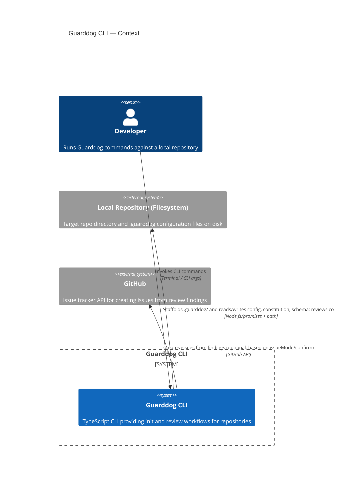

<!-- Generated by StrongAIAutoDoc 20260524 -->

Guarddog CLI bootstraps and runs automated repository reviews. Through `guarddog init`, it scaffolds a standard `.guarddog/` directory with configuration, reviewer guidance, and a findings JSON schema. Through `guarddog review`, it analyzes a target repository, applies configured thresholds, summarizes results, and can publish findings as GitHub issues. It interacts primarily with a developer running the CLI, the local filesystem containing the repository, and GitHub for optional issue creation.

Key components and external interactions: `init.ts` resolves a repository path, ensures a `.guarddog/` directory exists, and writes three baseline artifacts: `guarddog.config.json` (DEFAULT_CONFIG), `reviewer.md` (reviewer constitution), and `finding.schema.json` (review JSON schema). This work depends on filesystem access via Node `fs/promises` and path resolution utilities (`resolveRepoPath`, `writeTextFile`), with progress logged through `defaultLogger`. `review.ts` parses CLI flags into validated options, loads configuration and thresholds, runs the repository review (`runReview`), and prints a summary/exit code. When enabled, it renders issue drafts and submits them to GitHub via `createGitHubIssues`.