<!-- Generated by StrongAIAutoDoc 20260524 -->

This directory implements GuardDog’s architecture-review pipeline end to end. It loads configuration and optional design intent, scans a repository to build a compact “repo map,” discovers and prioritizes C4 architecture documents, and selects a bounded set of source/context files that fit within model token budgets. It then assembles prompt parameters, invokes an LLM through a small provider abstraction, validates and filters the structured review output, and finally renders Markdown (and optional JSON) reports. The modules emphasize deterministic fallbacks, strict schema validation, and reproducible, budget-aware context construction.

```mermaid
C4Component
title GuardDog Review Pipeline - Components

Component(reviewer, "reviewer.ts", "Orchestrator", "Runs the end-to-end review pipeline")
Component(configLoader, "configLoader.ts", "Config Loader", "Loads defaults + repo config + CLI overrides; validates thresholds")
Component(designLoader, "designLoader.ts", "Design Loader", "Finds/loads architecture intent document")
Component(repoScanner, "repoScanner.ts", "Repo Scanner", "Walks repo, detects languages/packages, finds notable files + C4 docs")
Component(c4Docs, "c4ArchitectureDocs.ts", "C4 Docs Helper", "Detects/sorts/caps generated C4 architecture markdown files")
Component(contextSelector, "contextSelector.ts", "Context Selector", "Chooses and reads context files; packs into token budgets")
Component(contextRanker, "contextRanker.ts", "Context Ranker", "Ranks candidate files via C4-aware LLM or heuristics")
Component(tokenPacker, "tokenBudgetPacker.ts", "Token Budget Packer", "Greedy packing of files into token budgets")
Component(promptBuilder, "reviewPromptBuilder.ts", "Review Prompt Builder", "Builds prompt params from repo map, design, context files")
Component(promptFactory, "promptFactory.ts", "Prompt Factory", "Creates prompt repository from bundled prompts; reads constitution text")
Component(llmProvider, "llmProvider.ts", "LLM Provider", "Executes prompts via chat driver; returns structured JSON result")
Component(findingParser, "findingParser.ts", "Finding Parser/Validator", "Validates/normalizes LLM JSON; saves debug response")
Component(findingFilter, "findingFilter.ts", "Finding Filter", "Applies min severity/impact and max findings; recomputes summary")
Component(markdownRenderer, "markdownRenderer.ts", "Markdown Renderer", "Renders IReviewResult into GitHub-ready Markdown")

System_Ext(repo, "Target Repository", "Filesystem", "Repo being reviewed")
System_Ext(llmApis, "LLM Provider APIs", "External Service", "Model endpoints used by chat driver")
System_Ext(fs, "Local Filesystem", "I/O", "Reads/writes config, context, debug, and report outputs")
System_Ext(promptRepoLib, "@jonverrier/prompt-repository", "Library", "Prompt repository + chat driver factory")

%% Orchestration flow
Rel(reviewer, configLoader, "loads configuration with", "TS call")
Rel(reviewer, designLoader, "loads design intent with", "TS call")
Rel(reviewer, repoScanner, "generates repo map with", "TS call")
Rel(reviewer, contextSelector, "selects context files with", "TS call")
Rel(reviewer, promptBuilder, "builds prompt parameters with", "TS call")
Rel(reviewer, llmProvider, "requests structured review via", "TS call")
Rel(reviewer, findingParser, "validates/parses review result with", "TS call")
Rel(reviewer, findingFilter, "filters findings with", "TS call")
Rel(reviewer, markdownRenderer, "renders markdown report with", "TS call")

%% Context selection internals
Rel(contextSelector, contextRanker, "ranks candidates using", "TS call")
Rel(contextSelector, c4Docs, "adds/sorts/caps C4 docs via", "TS call")
Rel(contextSelector, tokenPacker, "packs files into token budgets via", "TS call")

%% Ranking and scanning dependencies
Rel(contextRanker, c4Docs, "detects presence of C4 docs using", "TS call")
Rel(repoScanner, c4Docs, "finds C4 architecture files using", "TS call")

%% Prompt and LLM wiring
Rel(llmProvider, promptFactory, "loads prompts from", "TS call")
Rel(promptFactory, promptRepoLib, "constructs repository using", "library")
Rel(llmProvider, promptRepoLib, "uses chat driver + constrained JSON via", "library")
Rel(llmProvider, llmApis, "calls", "HTTPS")

%% I/O boundaries
Rel(configLoader, fs, "reads config file from", "read")
Rel(designLoader, fs, "reads design file from", "read")
Rel(repoScanner, repo, "walks and reads metadata in", "read")
Rel(contextSelector, repo, "reads candidate context files from", "read")
Rel(findingParser, fs, "writes debug responses to", "write")
Rel(reviewer, fs, "writes markdown/json outputs to", "write")
```

Key components: reviewer.ts orchestrates the full pipeline and is the main integration point. configLoader.ts merges defaults, repo config, and CLI overrides, ensuring validated thresholds that downstream filtering can trust. repoScanner.ts builds a compact repo map and relies on c4ArchitectureDocs.ts to recognize, prioritize, and cap generated C4 documents. contextSelector.ts assembles the prompt context: it adds C4 docs, requests ordering from contextRanker.ts (LLM-backed when C4 docs exist, heuristic otherwise), then applies tokenBudgetPacker.ts to stay within model budgets. reviewPromptBuilder.ts converts the repo map, design intent, and selected files into structured prompt parameters. llmProvider.ts executes prompts from promptFactory.ts and returns constrained JSON. findingParser.ts validates and normalizes that JSON (saving debug output when needed), then findingFilter.ts applies severity/impact/max limits before markdownRenderer.ts produces the final GitHub-ready report.