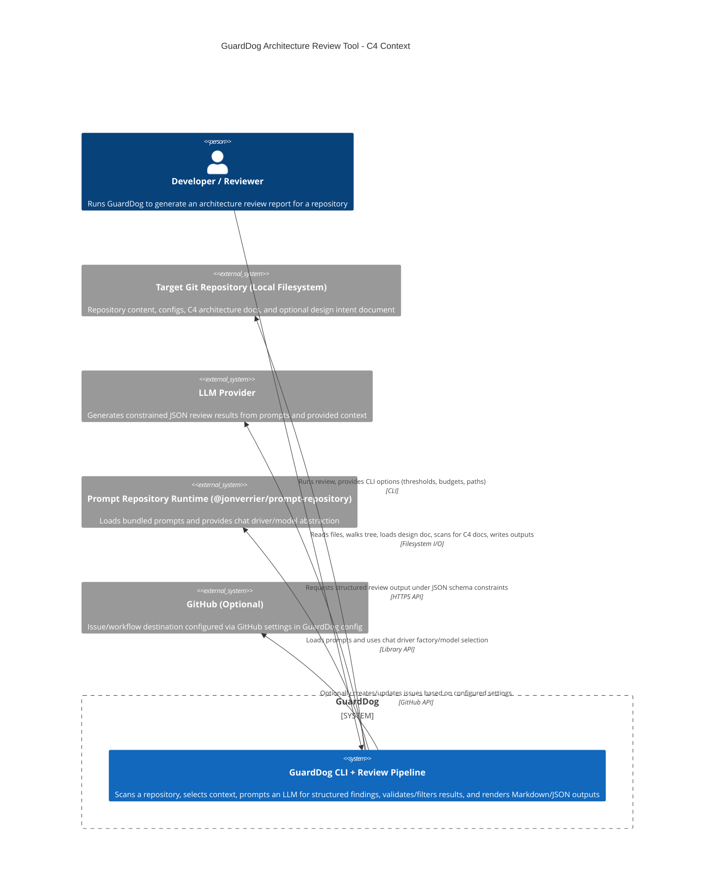

<!-- Generated by StrongAIAutoDoc 20260524 -->

GuardDog is a repository-focused architecture review tool that scans a target codebase, selects representative context files, and uses a Large Language Model (LLM) to produce a structured set of architecture findings and a Markdown report. It interacts with developers via CLI execution, reads local repository files (respecting .gitignore), and optionally uses a GitHub integration configuration to support issue-oriented workflows. GuardDog depends on an external prompt repository runtime and an external LLM provider for constrained JSON generation, then validates and filters results for severity and impact thresholds.

Key components and interactions center on the end-to-end review orchestrator (reviewer.ts), which ties together configuration loading (configLoader.ts), design intent retrieval (designLoader.ts), repo mapping (repoScanner.ts), and context assembly (contextSelector.ts). Context selection uses C4 document detection and prioritization (c4ArchitectureDocs.ts), ranking via an LLM-aware ranker or deterministic heuristics (contextRanker.ts), and token-budget packing (tokenBudgetPacker.ts) before building prompt parameters (reviewPromptBuilder.ts). The system depends on external prompt infrastructure (promptFactory.ts with @jonverrier/prompt-repository) and an external LLM endpoint (llmProvider.ts) to return schema-constrained JSON. Results are validated and normalized (findingParser.ts), filtered by thresholds (findingFilter.ts), and rendered for GitHub-ready consumption (markdownRenderer.ts).