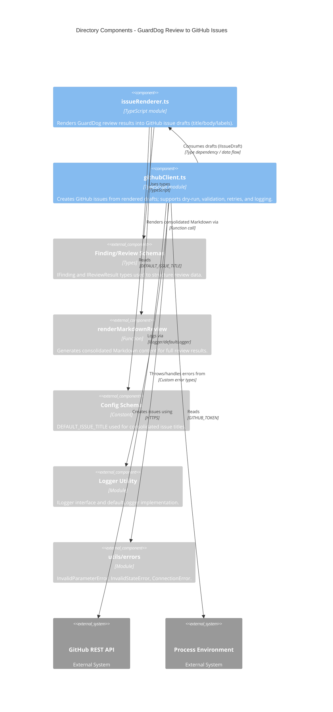

<!-- Generated by StrongAIAutoDoc 20260524 -->

These modules convert GuardDog architecture review results into GitHub issues. `issueRenderer.ts` transforms filtered review data into one consolidated issue draft or multiple per-finding drafts, producing consistent titles, Markdown bodies, and normalized labels. `githubClient.ts` then validates repository identifiers and either performs a dry run or creates real issues via the GitHub REST API. Together they form a small pipeline from review findings to actionable repository-tracked work items, with structured logging and defensive error handling.

**Key components (notes):**  
`issueRenderer.ts` is the formatting layer: it converts GuardDog review results into `IIssueDraft` objects with predictable titles, rich Markdown bodies, and normalized, de-duplicated labels. It supports both a single consolidated issue and per-finding issues, leveraging `renderMarkdownReview` and `DEFAULT_ISSUE_TITLE`. `githubClient.ts` is the integration layer: it validates `owner/name` repo identifiers, supports dry-run logging, and otherwise calls the GitHub Issues API using `GITHUB_TOKEN`. It relies on shared logging (`ILogger/defaultLogger`) and custom errors for invalid input, missing credentials, and network/API failures, including retry behavior when labels are rejected.