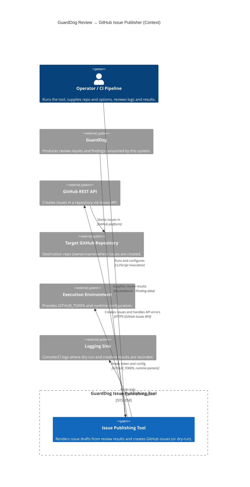

<!-- Generated by StrongAIAutoDoc 20260524 -->

This system converts GuardDog architecture review outputs into GitHub issues for tracking and remediation. It renders review results into issue drafts (single consolidated or one per finding), then optionally posts them to a target GitHub repository via the GitHub REST API. It interacts with review-result producers (GuardDog), operators or CI pipelines that run the tooling, and GitHub services for authentication, validation, and issue creation, with logging for visibility and dry-run support.

Key components and external interactions center on GitHub and review data flow. The issueRenderer transforms GuardDog review results into IIssueDraft objects, generating either a single consolidated issue (via Markdown rendering) or multiple per-finding issues with normalized, deduplicated labels. The githubClient validates the repository identifier, supports dry-run logging, and otherwise calls the GitHub Issues API to create issues, requiring GITHUB_TOKEN from the execution environment. It reports created issue numbers/URLs and retries without labels when GitHub rejects unknown labels. Logging is emitted via ILogger/defaultLogger for operators and CI visibility.