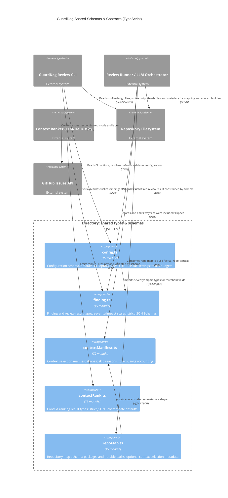

<!-- Generated by StrongAIAutoDoc 20260524 -->

This directory defines the shared schemas, defaults, and interchange formats that power GuardDog architecture reviews and its CLI. It standardizes configuration resolution (including GitHub issue behavior and token budgets), the canonical structure of review findings and final results, and the metadata used to rank and select repository files for an LLM context window. Together, these modules provide stable, validated contracts between the review runner, ranking/selection logic, and downstream output and integrations.

Key components: config.ts centralizes resolved configuration and CLI option types, including token budgets and GitHub issue modes. finding.ts defines the canonical finding/review-result contracts plus strict JSON Schemas that enable constrained LLM output and consistent downstream processing. contextRank.ts and contextManifest.ts work together: a ranker emits a validated ordering (rankedPaths), then selection logic records inclusion decisions, skip reasons, and token usage in a manifest for auditability. repoMap.ts captures a factual repository summary and optionally embeds contextSelection metadata, linking filesystem scanning to prompt assembly and reporting.