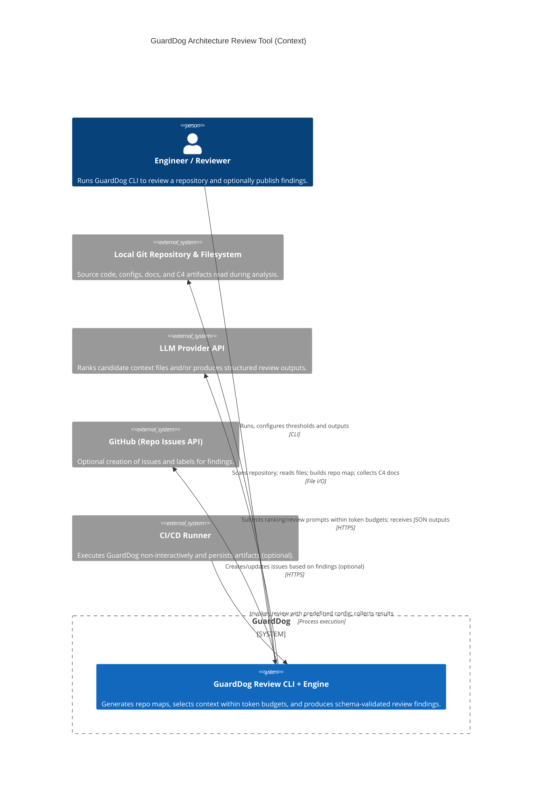

<!-- Generated by StrongAIAutoDoc 20260524 -->

GuardDog is an architecture review toolchain that analyzes a source repository and produces a structured set of findings with consistent severity, impact, and confidence. It builds a repository map, ranks and selects files to fit LLM token budgets, and emits validated JSON results for downstream use. It interacts primarily with engineers running the CLI, a GitHub repository for optional issue creation, the local filesystem for reading project files, and an LLM service for context ranking and review generation.

Key components and external interactions center on repository input, LLM calls, and optional GitHub publishing. The GuardDog system reads a local Git repository to build an IRepoMap, including package and directory structure plus detected C4 documentation files. It may call an LLM provider to rank candidate files (IContextRankResult) and to generate a schema-constrained review result (IReviewResult), tracking token budgets and producing a context selection manifest (IContextSelectionMeta) that explains inclusions and skips. When enabled via configuration, it integrates with GitHub to create one issue per finding or a single aggregated issue, applying default labels and titles.