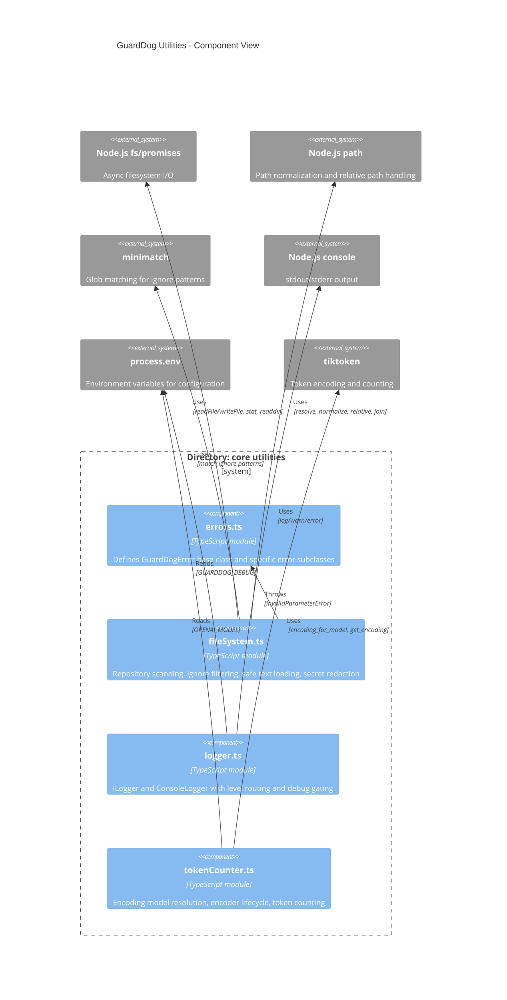

<!-- Generated by StrongAIAutoDoc 20260524 -->

This directory contains foundational utilities for GuardDog-style tooling: consistent error types, safe repository file scanning/loading, console-backed logging, and token counting for LLM prompt budgeting. The modules are designed as small, reusable building blocks with minimal coupling: `errors.ts` defines domain-specific failures, `fileSystem.ts` provides robust path validation and context file reading, `logger.ts` standardizes CLI logging behavior, and `tokenCounter.ts` estimates token usage via tiktoken encodings.

### Key components
`errors.ts` supplies a small hierarchy of GuardDog-specific `Error` subclasses, enabling consistent categorization (invalid parameter/operation/state and connection failures) across callers. `fileSystem.ts` is the most operational module: it validates repository roots, walks directories while honoring ignore patterns, and reads small, non-binary context files with secret redaction; it signals invalid inputs via `InvalidParameterError` from `errors.ts`. `logger.ts` standardizes CLI output with `ILogger` and `ConsoleLogger`, routing levels to stdout/stderr and enabling debug logs only when `GUARDDOG_DEBUG=1`. `tokenCounter.ts` integrates with `tiktoken` to resolve encoding models (optionally from `OPENAI_MODEL`), create/free encoders, and count tokens for budgeting.