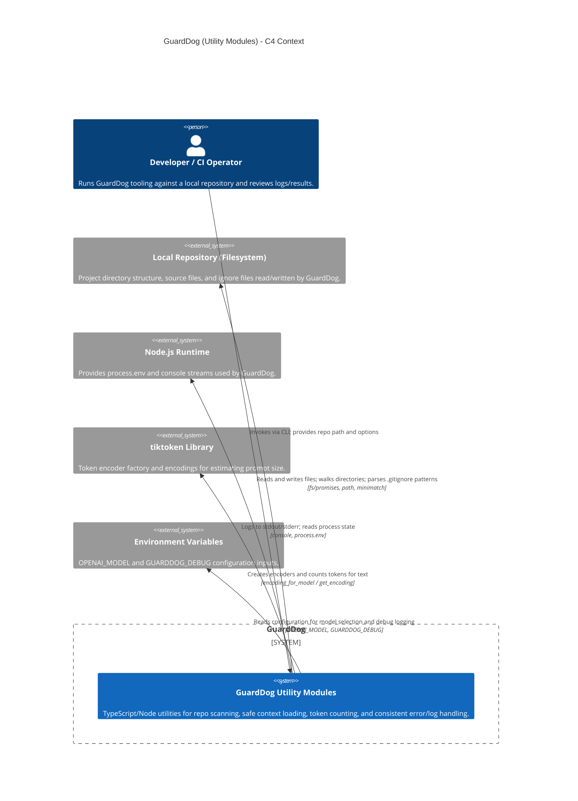

<!-- Generated by StrongAIAutoDoc 20260524 -->

GuardDog is a Node.js/TypeScript utility toolkit for CLI-style workflows that scan repositories, load safe text context, estimate LLM prompt sizes, and report issues consistently. It interacts primarily with a developer or CI operator running the CLI, the local filesystem hosting a target repository, and optional OpenAI-model configuration via environment variables. For token estimation it relies on tiktoken encoding data. Output is written to the terminal through standard console streams for human review.

GuardDog’s key external interaction is with the local repository on disk: it validates the repo path, walks directories while applying ignore patterns, reads small text files for context (with secret redaction), and can write output files while creating parent directories. Logging depends on Node’s console streams, routing info to stdout and warnings/errors to stderr, with debug gated by GUARDDOG_DEBUG. Token estimation depends on the external tiktoken library: GuardDog selects an encoding model (optionally from OPENAI_MODEL), builds an encoder, counts tokens for candidate prompts, and frees encoder resources. Consistent failure handling is provided through custom Error types surfaced to callers.