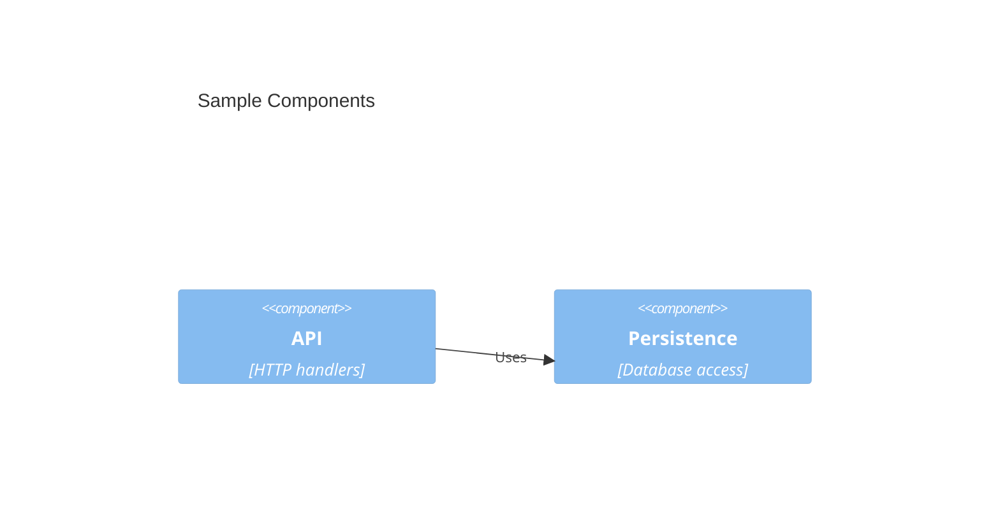

# Sample Component

Components in `src/`: API layer and persistence layer.

```mermaid
C4Component
title Sample Components
Component(api, "API", "HTTP handlers")
Component(persistence, "Persistence", "Database access")
Rel(api, persistence, "Uses")
```
